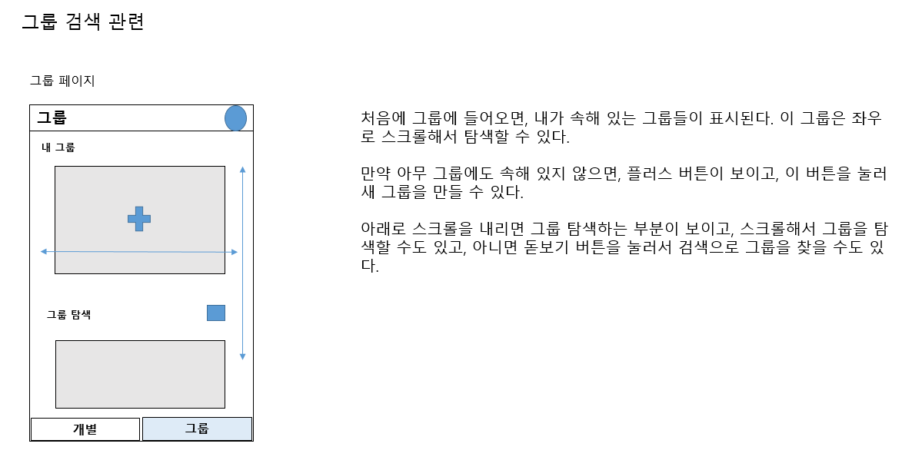

# onedayonesentence

## 무엇을 하는 어플인가?

하루에 최소 한 문장을 읽고, 이를 기록하고 그룹원들과 공유해볼 수 있는 어플리케이션입니다.

## MVP는 무엇인가

- 매일 책을 읽고, 기억에 남는 부분을 작성할 수 있고, 이를 달력으로 쉽게 조회해 볼 수 있음
- 그룹에 가입할 수 있으며, 이때, 그룹원들이 매일 어떤 글을 작성했는지 조회해 볼 수 있음

## 간단한 화면 설계

### 개별 화면 설계

### 그룹 화면 설계

### 글 작성 부분 설계

### 그룹 검색 부분 설계

### 그룹 Detail 부분 설계

## 추가로 고려해야 할 일(23.11.11 기준)

- 자기가 작성한 글을 어떤 식으로 공유하게 할지
